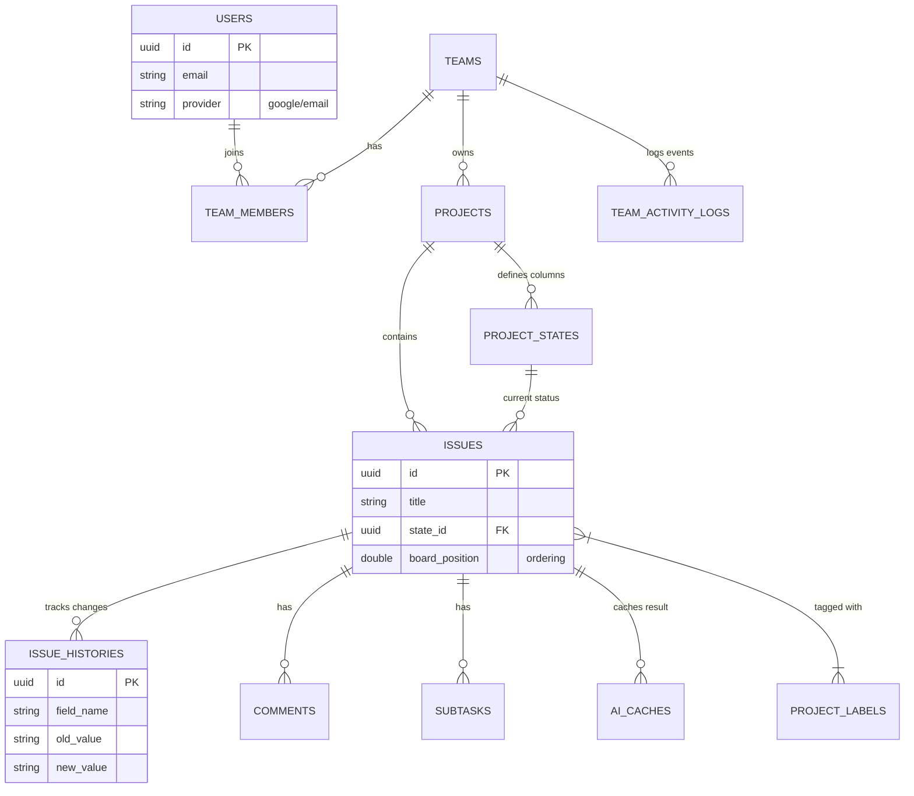

# 📘 Jira Lite Extended - Database Schema Specification (v2.0)

## 1\. 개요 (Overview)

  * **Target Engine**: PostgreSQL 14+
  * **Naming Convention**: `snake_case` (테이블 및 컬럼명)
  * **설계 핵심 목표**:
    1.  **이력 관리 분리**: 팀 활동 로그(거시적)와 이슈 변경 이력(미시적)을 분리하여 조회 성능 최적화.
    2.  **검색 성능 보장**: 이슈 검색 및 알림 조회를 위한 인덱싱 전략 포함.
    3.  **유연한 워크플로우**: 프로젝트별 커스텀 칸반 상태(State) 지원.
    4.  **데이터 무결성**: Soft Delete와 참조 무결성(Foreign Key)의 조화.

-----

## 2\. ERD (Entity Relationship Diagram)

주요 엔티티 간의 관계를 시각화했습니다. `issue_histories`가 별도로 분리된 점에 주목하십시오.

-----

## 3\. 상세 테이블 명세 (Table Details)

### 3.1 사용자 및 인증 (User & Auth)

#### `users`

**FR-001, 002, 004, 005**: 서비스의 주체. 이메일 가입과 OAuth 가입을 모두 지원합니다.

| 컬럼명 | 타입 | 제약조건 | 설명 |
| :--- | :--- | :--- | :--- |
| `id` | UUID | PK | `gen_random_uuid()` |
| `email` | VARCHAR(255) | UNIQUE, NOT NULL | 로그인 아이디 |
| `password_hash` | VARCHAR(255) | NULLable | Google 로그인 유저는 NULL |
| `name` | VARCHAR(50) | NOT NULL | 사용자 이름 |
| `profile_image` | TEXT | NULLable | 프로필 이미지 URL |
| `google_id` | VARCHAR(255) | UNIQUE | Google OAuth 고유 식별자 |
| `deleted_at` | TIMESTAMP | NULLable | **Soft Delete** 필드 |

#### `password_reset_tokens`

**FR-003**: 비밀번호 재설정용 임시 토큰.

| 컬럼명 | 타입 | 설명 |
| :--- | :--- | :--- |
| `user_id` | UUID | 대상 유저 (FK) |
| `token` | VARCHAR | 인증 토큰 |
| `expires_at` | TIMESTAMP | 만료 시간 (1시간) |

-----

### 3.2 팀 및 조직 (Team & Organization)

#### `teams`

**FR-010**: 최상위 조직 단위.

| 컬럼명 | 타입 | 설명 |
| :--- | :--- | :--- |
| `owner_id` | UUID | 팀 소유자 (FK) |
| `deleted_at` | TIMESTAMP | Soft Delete 필드 |

#### `team_members`

**FR-013\~018**: 사용자와 팀의 N:M 관계 및 역할 정의.

| 컬럼명 | 타입 | 설명 |
| :--- | :--- | :--- |
| `team_id` | UUID | 팀 ID (FK) |
| `user_id` | UUID | 사용자 ID (FK) |
| `role` | ENUM | `OWNER`, `ADMIN`, `MEMBER` |
| **Index** | | `UNIQUE(team_id, user_id)` |

#### `team_activity_logs`

**FR-019**: 팀 차원의 주요 이벤트 로그 (멤버 가입, 프로젝트 생성 등).

| 컬럼명 | 타입 | 설명 |
| :--- | :--- | :--- |
| `team_id` | UUID | 소속 팀 (FK) |
| `actor_id` | UUID | 행위자 (FK) |
| `target_type` | VARCHAR | 예: 'PROJECT', 'MEMBER' |
| `action_type` | VARCHAR | 예: 'CREATED', 'LEFT' |
| `details` | JSONB | 변경 상세 데이터 (스냅샷) |

-----

### 3.3 프로젝트 및 워크플로우 (Project & Workflow)

#### `projects`

**FR-020\~026**: 이슈들의 집합.

| 컬럼명 | 타입 | 설명 |
| :--- | :--- | :--- |
| `name` | VARCHAR(100) | 프로젝트명 |
| `is_archived` | BOOLEAN | 아카이브 여부 (기본 FALSE) |

#### `project_states` (핵심)

**FR-053, 054**: 프로젝트별 칸반 컬럼 정의. **이슈의 상태는 이 테이블의 ID를 참조합니다.**

| 컬럼명 | 타입 | 설명 |
| :--- | :--- | :--- |
| `project_id` | UUID | 프로젝트 ID (FK) |
| `name` | VARCHAR(30) | 상태명 (예: Done) |
| `position` | DOUBLE | 컬럼 표시 순서 (1.0, 2.0...) |
| `wip_limit` | INTEGER | 최대 이슈 허용 수 (NULL=무제한) |

-----

### 3.4 이슈 및 히스토리 (Issue & Tracking)

#### `issues`

**FR-030\~037**: 핵심 작업 티켓.

| 컬럼명 | 타입 | 설명 |
| :--- | :--- | :--- |
| `state_id` | UUID | **현재 상태** (`project_states.id` FK) |
| `assignee_id` | UUID | 담당자 (FK, Nullable) |
| `priority` | ENUM | `HIGH`, `MEDIUM`, `LOW` |
| `title` | VARCHAR(200) | 제목 |
| `board_position` | DOUBLE | **컬럼 내 정렬 순서** (Drag\&Drop용) |
| `deleted_at` | TIMESTAMP | Soft Delete 필드 |

#### `issue_histories` (New & Improved)

**FR-039**: 이슈의 필드 변경 사항만 **별도로 기록**하여 성능 최적화.

| 컬럼명 | 타입 | 설명 |
| :--- | :--- | :--- |
| `issue_id` | UUID | 대상 이슈 (FK) |
| `actor_id` | UUID | 변경한 사람 (FK) |
| `field_name` | VARCHAR | 변경된 필드명 ('STATUS', 'ASSIGNEE' 등) |
| `old_value` | TEXT | 변경 전 값 (문자열 변환) |
| `new_value` | TEXT | 변경 후 값 |
| `created_at` | TIMESTAMP | 변경 일시 |

#### `issue_labels` & `project_labels`

**FR-038**: 라벨링 시스템. N:M 관계 테이블 포함.

-----

### 3.5 AI 기능 (AI Features)

#### `ai_caches`

**FR-040, 041, 045**: 비용 절감을 위한 결과 저장소.

| 컬럼명 | 타입 | 설명 |
| :--- | :--- | :--- |
| `feature_type` | ENUM | `SUMMARY`, `SUGGESTION`, `COMMENT_SUMMARY` |
| `input_hash` | VARCHAR(64) | **SHA256(Input)**. 변경 감지 및 캐시 Hit용 |
| `output_text` | TEXT | LLM 응답 결과 |
| **Constraint** | | `UNIQUE(issue_id, feature_type, input_hash)` |

-----

## 4\. 인덱싱 전략 (Performance Optimization)

개선된 스키마는 PRD 요구사항에 맞춰 다음 인덱스를 필수로 생성해야 합니다.

1.  **이슈 검색 최적화**:
      * `CREATE INDEX idx_issues_search_title ON issues(title);`
      * `title` 기반 `LIKE` 검색 속도 향상.
2.  **칸반 보드 로딩 속도**:
      * `CREATE INDEX idx_issues_project_state ON issues(project_id, state_id);`
      * 프로젝트 진입 시 칸반 보드 렌더링 최적화.
3.  **내 업무/알림 조회**:
      * `CREATE INDEX idx_issues_assignee ON issues(assignee_id);`
      * `CREATE INDEX idx_notifications_user_unread ON notifications(user_id) WHERE is_read = FALSE;`
4.  **Soft Delete 필터링**:
      * `CREATE INDEX idx_issues_deleted_at ON issues(deleted_at) WHERE deleted_at IS NULL;`
      * 삭제되지 않은 데이터만 빠르게 조회.

-----

## 5\. 개발 가이드 (Implementation Notes)

### 5.1 이슈 히스토리 기록 (History Tracking)

백엔드 로직에서 `issues` 테이블을 업데이트할 때, **반드시 변경 사항을 감지하여 `issue_histories`에 Insert** 해야 합니다.

  * **Case**: 사용자가 상태를 'Backlog' → 'In Progress'로 드래그.
  * **Action**:
    1.  `UPDATE issues SET state_id = ?, board_position = ? ...`
    2.  `INSERT INTO issue_histories (issue_id, field_name, old_value, new_value) VALUES (..., 'STATUS', 'Backlog', 'In Progress')`

### 5.2 커스텀 상태 초기화 (Custom Status Init)

프로젝트 생성(`POST /projects`) 시, 백엔드는 자동으로 **기본 3개 상태**를 `project_states`에 생성해주어야 합니다.

  * 1: `Backlog` (pos: 1.0)
  * 2: `In Progress` (pos: 2.0)
  * 3: `Done` (pos: 3.0)

### 5.3 AI 캐싱 로직 (AI Caching)

AI 기능 요청 시 항상 DB를 먼저 확인하십시오.

  * `Key`: `issue_id` + `feature_type` + `Hash(현재 description)`
  * DB에 있으면 반환 (API 호출 X, 비용 0)
  * DB에 없으면 API 호출 후 저장.

### 5.4 데이터 제한 (Validation)

다음 제한 사항은 DB 스키마가 아닌 **Service Layer 코드**에서 검증해야 합니다.

  * 팀당 프로젝트 최대 15개.
  * 프로젝트당 이슈 최대 200개.
  * 이슈당 서브태스크 최대 20개.